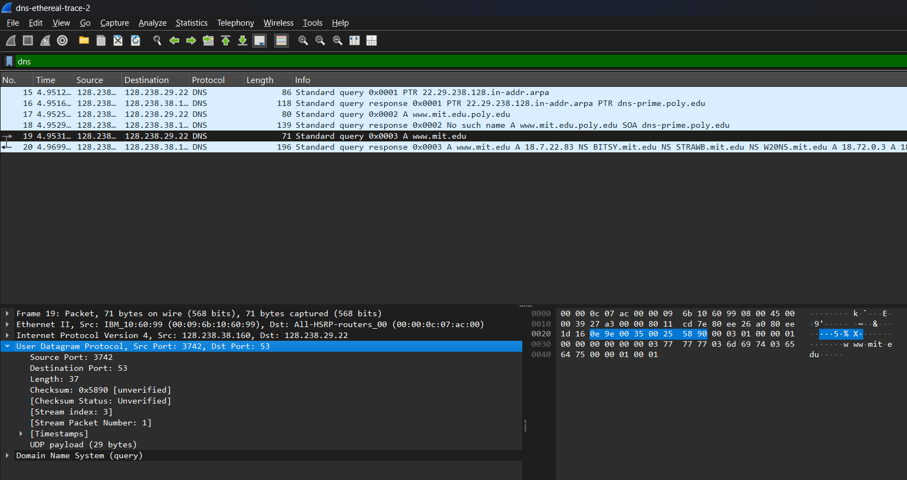
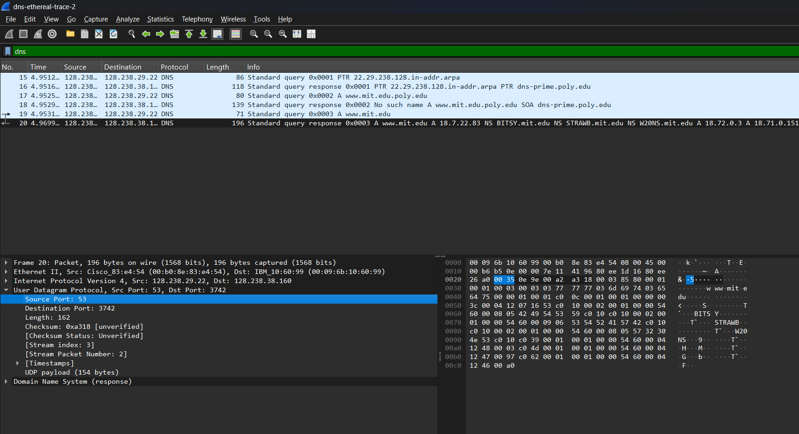
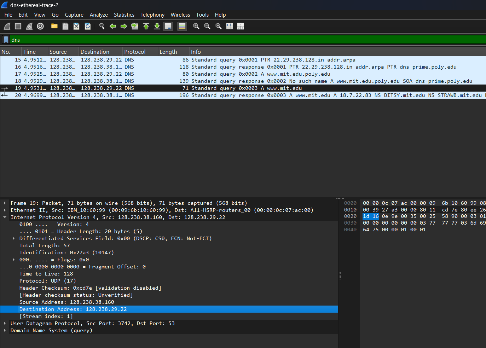
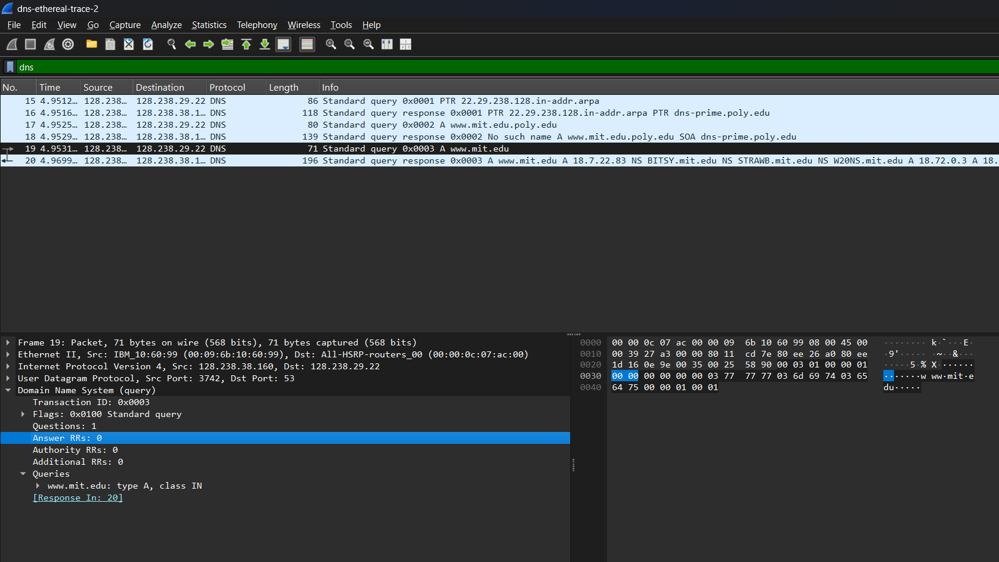
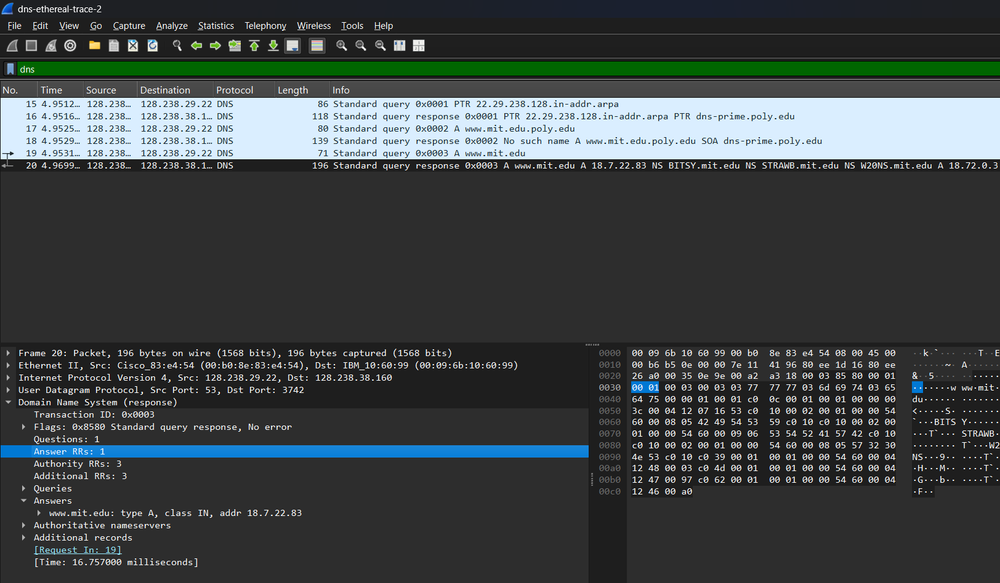

## Perintah nslookup www.mit.edu
1. Apa port tujuan pada pesan permintaan DNS? Apa port sumber pada pesan balasan DNS? 
2. Ke alamat IP manakah pesan permintaan DNS dikirimkan? Apakah alamat IP tersebut 
merupakan default alamat IP server DNS lokal Anda? 
3. Periksa pesan permintaan DNS. Apa ”jenis” atau ”type” dari pesan tersebut? Apakah pesan 
tersebut mengandung ”jawaban” atau ”answers”? 
4. Periksa pesan balasan DNS. Berapa banyak ”jawaban” atau “answers” yang terdapat di 
dalamnya. Apa saja isi yang terkandung dalam setiap jawaban tersebut? 
# Jawaban :
1. 
Port tujuan
 
Port sumber 

---

2. 
 
Pesan permintaan DNS dikirimkan ke alamat IP 128.238.29.22. Alamat IP tersebut merupakan default alamat IP server DNS lokal saya.

---

3.

Jenis atau type dari pesan tersebut adalah A. Pesan tersebut tidak mengandung jawaban atau answers.

---

4.

Hanya ada 1 jawaban.