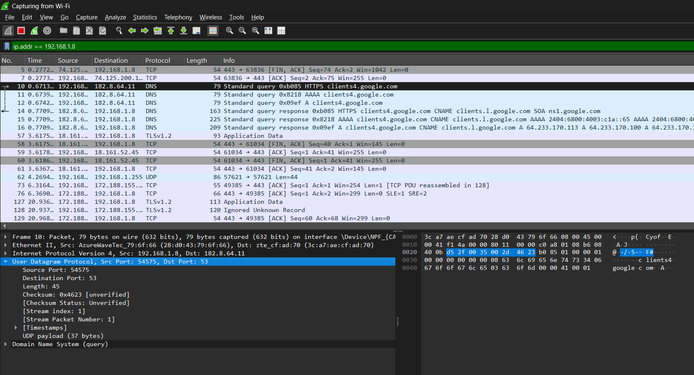
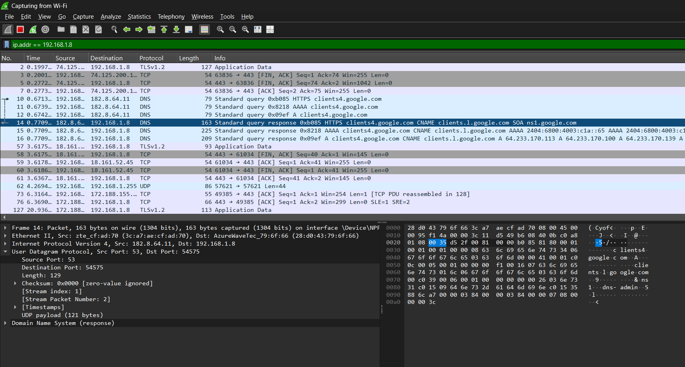
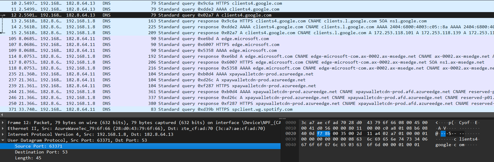
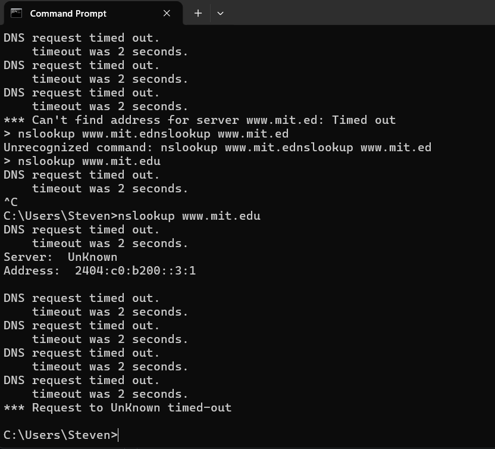
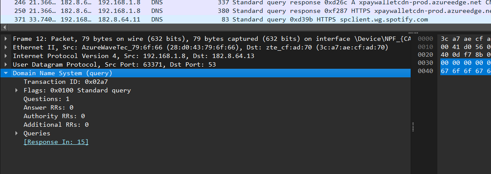
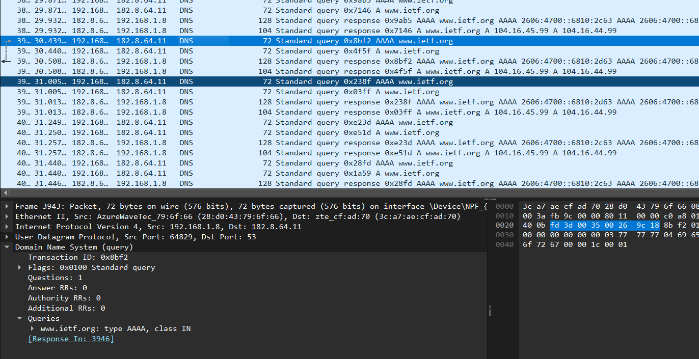
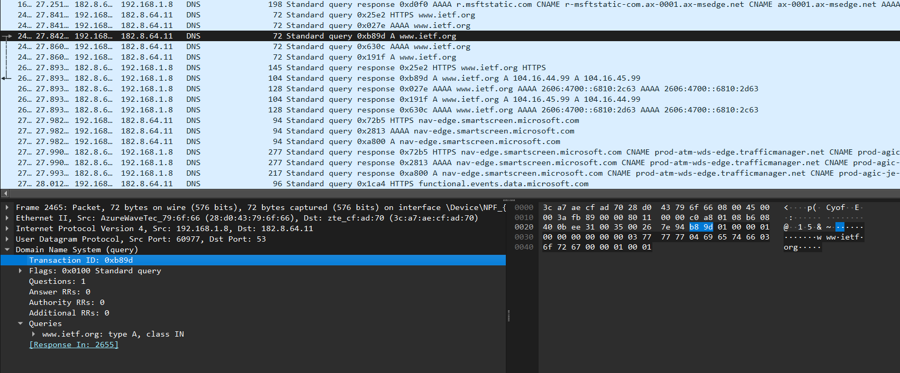

# Laporan Analisis & Pertanyaan Mengenai Protokol DNS (Wireshark Trace)

### 1. Cari pesan permintaan DNS dan balasannya. Apakah pesan tersebut dikirimkan melalui UDP atau TCP?
Pesan permintaan (*query*)
 
Pesan balasan (*response*)  Pesan tersebut dikirimkan melalui UDP

---

### 2. Apa port tujuan pada pesan permintaan DNS? Apa port sumber pada pesan balasannya?
:
* **Pesan Permintaan (Query):** * Source Port: **54575**
    * Destination Port: **53**

* **Pesan Balasan (Response):** * Source Port: **53**
    * Destination Port: **54575**

---

### 3. Pada pesan permintaan DNS, apa alamat IP tujuannya? Apa alamat IP server DNS lokal anda (gunakan ipconfig untuk mencari tahu)? Apakah kedua alamat IP tersebut sama?

* **Analisis:** Kedua alamat IP tersebut **tidak sama** (**timed out**)
---

### 4. Periksa pesan permintaan DNS. Apa “jenis” atau ”type” dari pesan tersebut? Apakah pesan permintaan tersebut mengandung ”jawaban” atau ”answers”?
* **Jenis (Type):** **Type A** (Host Address).
* **Jawaban (Answers):** Pesan permintaan tersebut **tidak mengandung jawaban** (*0 answers*).
, bagian `Answer RRs` menunjukkan nilai **0**. Pesan ini hanya berisi pertanyaan untuk mencari alamat IPv4 dari `www.ietf.org`.

---

### 5. Periksa pesan balasan DNS. Berapa banyak ”jawaban” atau ”answers” yang terdapat di dalamnya? Apa saja isi yang terkandung dalam setiap jawaban tersebut?
 hanya satu jawaban.

---

### 6. Perhatikan paket TCP SYN yang selanjutnya dikirimkan oleh host Anda. Apakah alamat IP pada paket tersebut sesuai dengan alamat IP yang tertera pada pesan balasan DNS?
* **Analisis:** Setelah resolusi DNS selesai, host mengirimkan paket **TCP SYN** (paket nomor 10) untuk memulai koneksi HTTP.
* **Hasil:** Alamat IP tujuan pada paket TCP tersebut adalah **132.151.6.75**.
* **Kesimpulan:** **Ya, sesuai.**  .

---

### 7.  Apakah host Anda perlu mengirimkan pesan permintaan DNS baru setiap kali ingin mengakses suatu gambar?
 **Tidak perlu.**
host dapat langsung melakukan permintaan HTTP GET untuk mengambil