# Cara Penggunaan WireShark: Interupting & Analysing Traffic Network

Pada file ini saya akan menjelaskan langkah-langkah dasar melakukan pemantauan traffic network menggunakan Wireshark untuk analisis keamanan web melalui jaringan.

---

## 1. Persiapan Tools

Langkah awal adalah membuka aplikasi Wireshark.

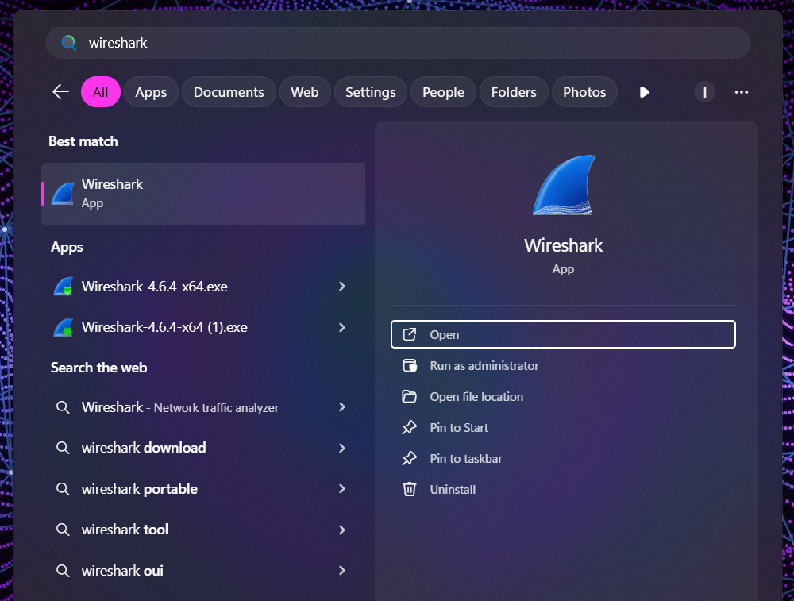
* **Langkah:** Open **lalu akan muncul tampilan seperti gambar dibawah ini**.

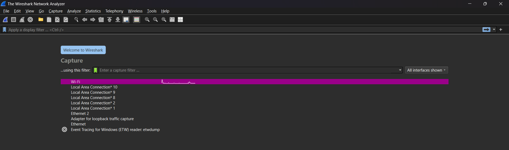
* **Langkah:** Pilih **Wifi** lalu Klik **Enter**.

---

## 2. Analisis Trafic Network (lalu lintas jaringan)

Dibawah ini adalah lalu lintas jaringan pada wifi yang sedang saya gunakan sekarang ini.

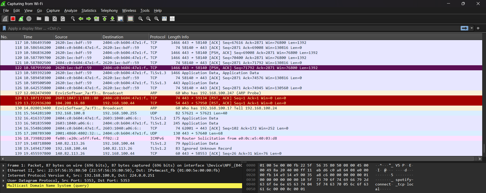

---

## 3. konfigurasi Proses Capture

Proses mengatur konfigurasi proses capture (penangkapan paket data) sebelum Wireshark mulai merekam traffic jaringan.

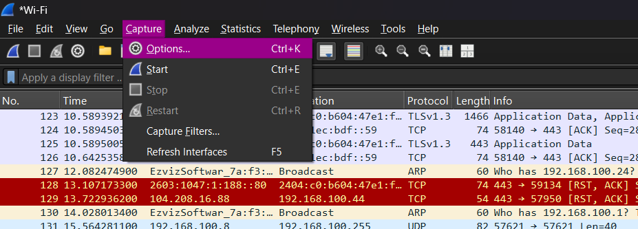
* **Langkah:** Klik Capture lalu **Option**. Lalu akan muncul tampilan seperti gambar dibawah ini.

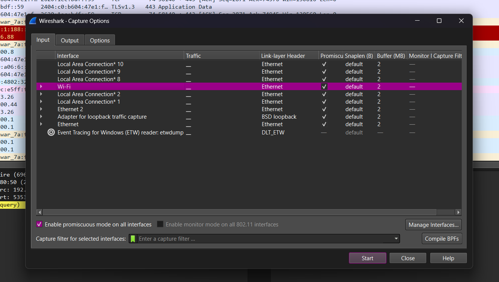
* **Langkah:** Pilih interface mana yang ingin anda lakukan penangkapan paket nya, Disini saya akan melakukan pada **wifi** Pilih **Wi-Fi** lalu klik **Start**.

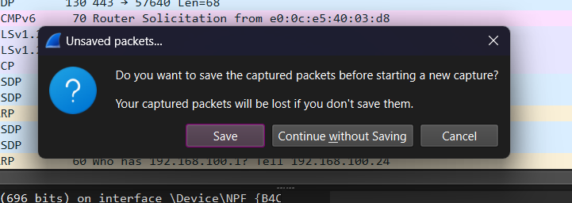
* **Langkah:** Jika muncul seperti itu klik saja yang tengah **Continue without Saving**. Lalu akan muncul tampilan seperti gambar dibawah ini.

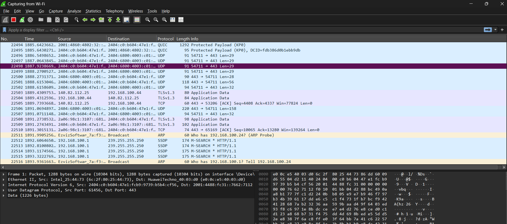
Jika sudah maka akan muncul semua aktivitas lalulintas dari wifi yang digunakan.

---

## 4. Analisis HTTP History

Melihat rekam jejak semua request yang telah melalui proxy.

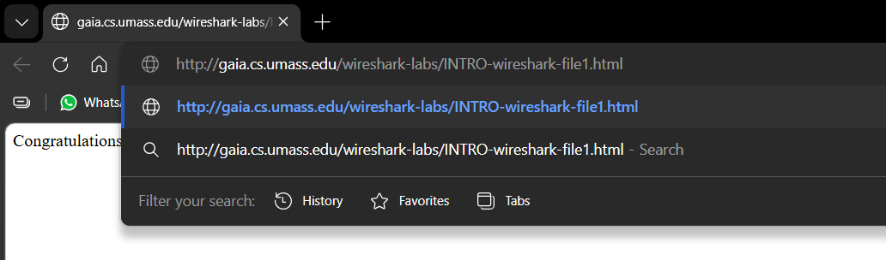
* **Langkah:** Buka browser apa saja lalu ketikkan link pada gambar tersebut **HTTP jangan HTTPS ya**.

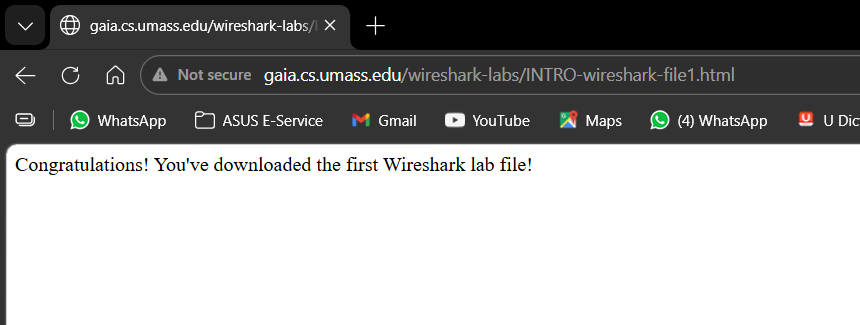
* **Maka akan muncul tampilan web seperti itu**.

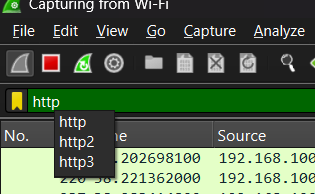
* **Langkah:** Kembali ke **wireshark** lalu pada bagian filter ketikkan **http** sampai background berwarna hijau dan klik **enter**.

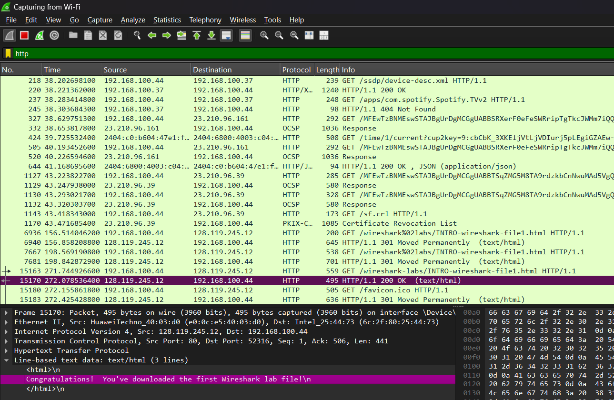
* **Detail:** Klik pada salah satu baris history yang berwarna ungu pada gambar tersebut untuk melihat detail **Request** (data yang dikirim) dan **Response** (balasan dari server) di panel bagian bawah.

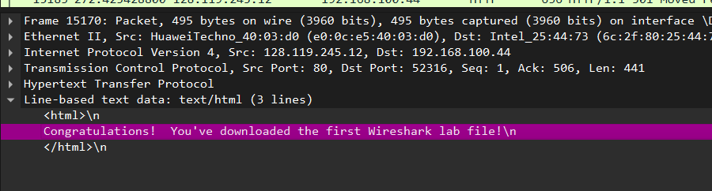
* **Detail:** Bisa kita lihat pesan yang ada di web sebelumnya terlihat di history paket juga.

---
