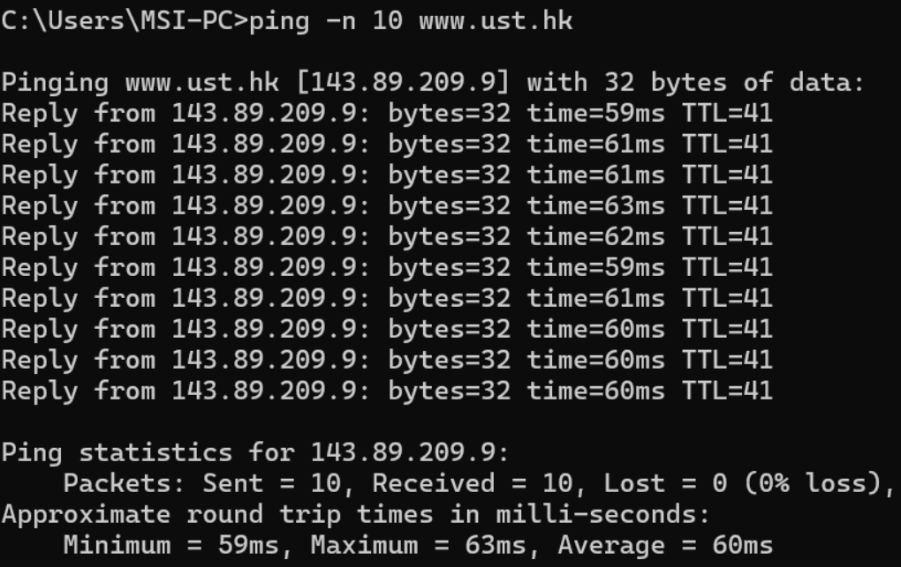
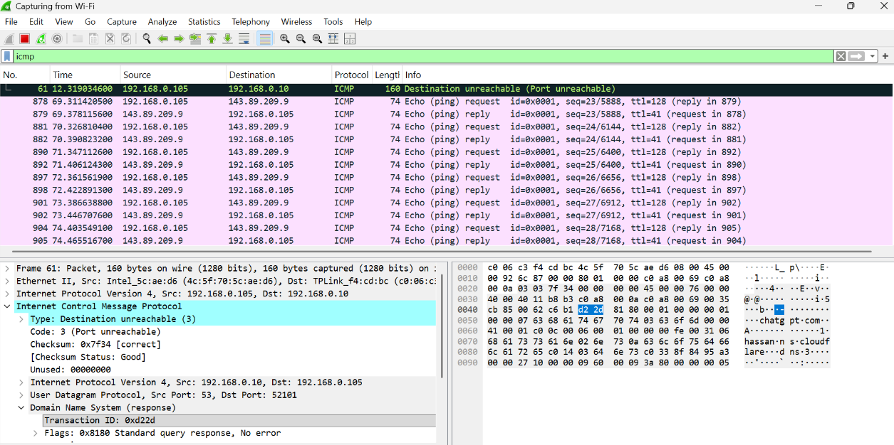
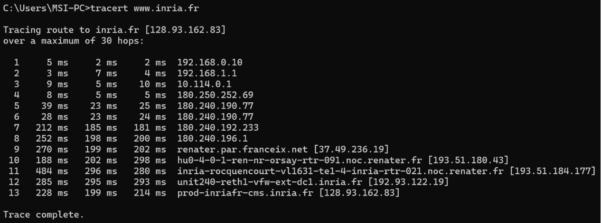
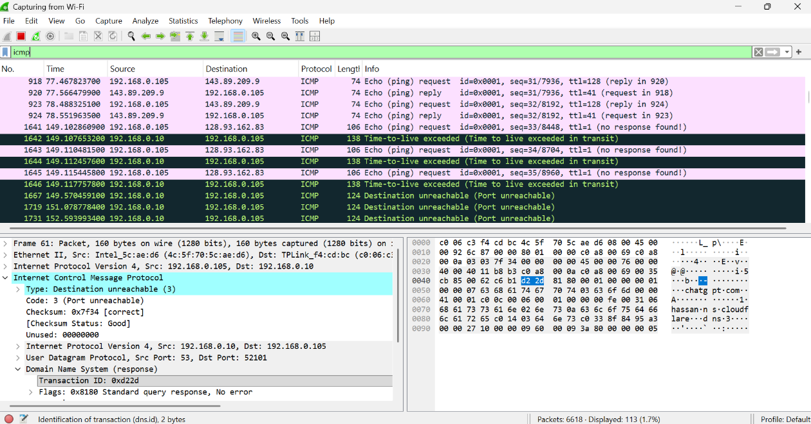

## Rangkuman Praktikum Modul 12 (ICMP (Internet Control Message Protocol))

# Steven Indramer (103072400070/IF 04-04)

1. Hasil eksekusi perintah ping -n 10 www.ust.hk mengonfirmasi bahwa domain berhasil diterjemahkan menjadi alamat IP 143.89.209.9. Sebanyak 10 paket data berhasil dikirim dan diterima tanpa kehilangan paket (0% packet loss), sehingga tingkat keandalan jaringan mencapai 100%.

Berdasarkan hasil perekaman pada lapisan data (data link layer) menggunakan Wireshark, proses sinkronisasi antara host pengirim 10.218.2.21 dan host tujuan 143.89.209.9 dapat diamati melalui struktur paket pada frame 180 dan 181 berikut.

- Echo Request (Paket 180): Paket permintaan dikirim dengan nilai Type = 8 dan Code = 0. Host pengirim menyertakan Sequence Number sebesar 315 (0x013b) serta Identifier bernilai 1 sebagai penanda paket.
- Echo Reply (Paket 181): Paket balasan diterima dari server dengan nilai Type = 0 dan Code = 0. Paket ini mempertahankan Sequence Number (315) dan Identifier (1) yang sama dengan paket permintaan sebelumnya.
- Prinsip Korelasi Data: Kesesuaian nilai Sequence Number dan Identifier pada kedua paket tersebut berfungsi sebagai mekanisme identifikasi yang memungkinkan network stack sistem operasi mencocokkan paket permintaan dan balasan. Dengan demikian, sistem dapat memantau keandalan koneksi serta menghitung nilai Round-Trip Time (RTT) secara akurat.

2. Analisis Mekanisme Ekskalasi TTL pada Traceroute

Proses pelacakan rute menuju www.inria.fr (128.93.162.83) berhasil diselesaikan melalui 19 hop. Hasil pengujian menunjukkan bahwa nilai latensi meningkat seiring dengan bertambahnya jarak geografis dan jumlah router perantara yang dilewati oleh paket data.

- Segmen Jaringan Internal: Paket data terlebih dahulu melewati gerbang lokal pada hop 1 (192.168.0.1), hop 2 (192.168.2.1), dan hop 3 (10.108.0.1) dengan waktu respons yang relatif rendah, yaitu berkisar antara 1–6 ms.
- Segmen Transit Internasional: Setelah memasuki jaringan backbone internasional, terjadi peningkatan latensi yang signifikan. Paket kemudian melintasi beberapa router global hingga mencapai server tujuan pada hop ke-19 dengan waktu respons akhir sebesar 275 ms.

Mekanisme Pelaporan Galat (Error Reporting): Utilitas tracert pada sistem operasi Windows memanfaatkan paket ICMP secara berulang dengan cara menaikkan nilai Time To Live (TTL) secara bertahap (TTL = 1, TTL = 2, dan seterusnya). Ketika paket dengan nilai TTL = 1 mencapai router pertama, nilai TTL tersebut habis sehingga router membuang paket yang diterima. Sebagai respons, router mengirimkan pesan ICMP Type 11 (Time-to-live exceeded) dengan Code = 0. Paket galat ini, seperti yang terlihat pada Paket 10, menyertakan salinan header paket asli sehingga host pengirim dapat mengidentifikasi paket yang menyebabkan terjadinya kesalahan.