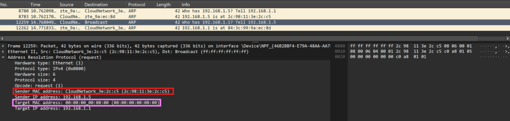
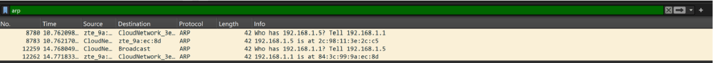
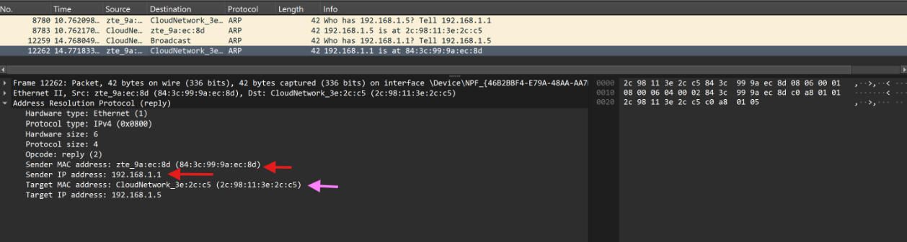

## **LAPORAN PRAKTIKUM MODUL 13**

## Caching ARP
ARP caching berfungsi untuk menyimpan sementara hasil pemetaan antara alamat IP dan alamat MAC yang telah diperoleh melalui proses ARP. Dengan adanya cache, host tidak perlu mengirim ARP Request setiap kali akan berkomunikasi dengan perangkat yang sama sehingga komunikasi menjadi lebih cepat dan efisien.

Untuk memulai, langkah pertama yang diperlukan adalah menghapus cache ARP:

- Untuk **MS-DOS** gunakan perintah arp –d *. Bendera –d mengindikasikan operasi penghapusan, dan * adalah wildcard yang mengatakan untuk 
  menghapus semua entri tabel. 

- Untuk **Linux/Unix/MacOS** gunakan perintah arp –d *. Untuk menjalankan perintah ini diperlukan hak akses root.

## Mengamati Aksi ARP

- Setelah memastikan cache browser kosong, mulai sniffer paket wireshark.
- Masukkan URL berikut ke dalam browser:
  http://gaia.cs.umass.edu/wireshark-labs/HTTP-ethereal-lab-file3.html
- Hentikan penangkapan paket wireshark.
- Pilih Analyze -> Enabled Protocols. Kemudian hapus centang pada 
kotak IP dan pilih OK. Hal ini bertujuan untuk mengurangi paket-paket lain yang tidak relevan sehingga proses pengamatan dan analisis paket ARP menjadi lebih mudah dilakukan.
- Gunakan filter "ARP" untuk hanya fokus pada paket ARP saja, lalu enter.

Berikut tampilan paket pada wireshark:

 

Pilih paket dengan Destination **Broadcast**:

Kotak merah menunjukkan MAC address pengirim (laptop), yaitu **2c:98:11:3e:2c:c5**. Kotak ungu menunjukkan MAC address tujuan yang masih belum diketahui sehingga bernilai **00:00:00:00:00:00**. Oleh karena itu, paket **ARP Request** dikirim secara **broadcast** untuk mencari MAC address dari host dengan **IP 192.168.1.1**. Karena paket dikirim secara broadcast, alamat MAC tujuan pada Ethernet frame bernilai **ff:ff:ff:ff:ff:ff**, yang berarti paket tersebut dikirim ke seluruh perangkat dalam jaringan lokal agar perangkat yang memiliki IP **192.168.1.1** dapat memberikan balasan (ARP Reply).

Lalu pilih paket 12262:

Pada paket ARP Reply, IP address pengirim **192.168.1.1** dipetakan dengan MAC address **84:3c:99:9a:ec:8d**. Dengan kata lain, host yang memiliki IP **192.168.1.1** memberitahukan bahwa MAC address miliknya adalah **84:3c:99:9a:ec:8d**. Balasan ini dikirim kepada laptop dengan **IP 192.168.1.5** dan MAC address **2c:98:11:3e:2c:c5**. Sehingga bisa disimpulkan bahwa **IP 192.168.1.1** memiliki MAC address **84:3c:99:9a:ec:8d**.

## Kesimpulan 
Berdasarkan hasil pengamatan menggunakan Wireshark, protokol ARP digunakan untuk menerjemahkan alamat IP menjadi alamat MAC pada jaringan lokal. Ketika host belum mengetahui MAC address dari suatu alamat IP, host akan mengirimkan ARP Request secara broadcast ke seluruh perangkat dalam jaringan. Perangkat yang memiliki alamat IP yang dicari kemudian akan mengirimkan ARP Reply yang berisi MAC address miliknya. Hasil pengamatan menunjukkan bahwa host dengan **IP 192.168.1.1** memiliki MAC address **84:3c:99:9a:ec:8d**. Informasi pemetaan IP dan MAC tersebut kemudian disimpan dalam ARP cache sehingga komunikasi berikutnya dapat dilakukan tanpa perlu mengirim ARP Request kembali, yang membuat proses komunikasi menjadi lebih cepat dan efisien.