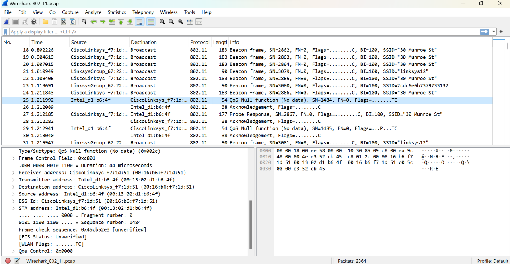
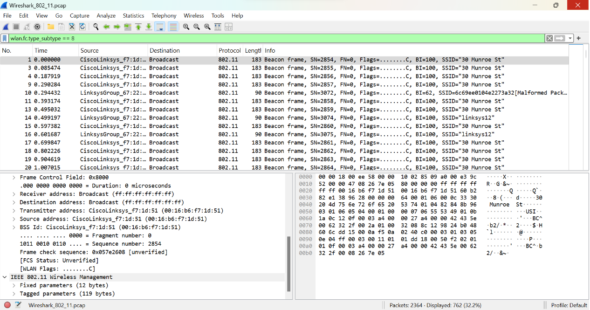
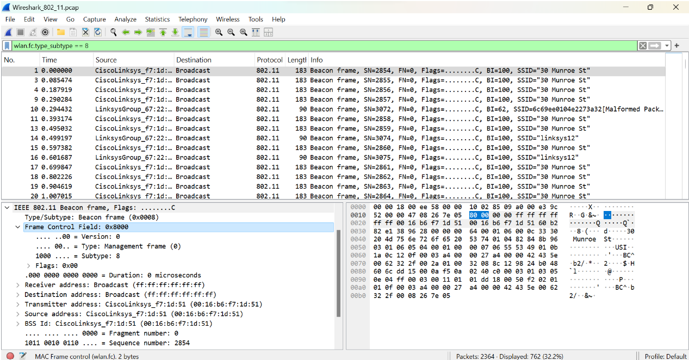
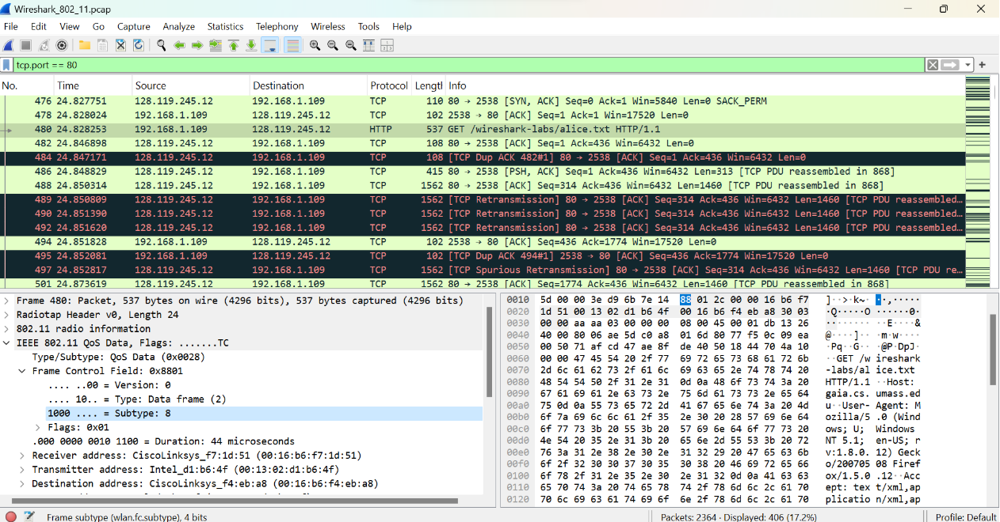

# Praktikum Modul 14

## Steven Indramer (103072400070/IF 04-04)

1. Gambar ini menampilkan capture paket pada file Wireshark_802_11.pcap tanpa filter apapun. Terlihat berbagai jenis frame 802.11 yang tertangkap, di antaranya Beacon frame dari AP "30 Munroe St" (sumber: CiscoLinksys_f7:1d) dan "linksys12" (sumber: LinksysGroup_67:22), serta frame bertipe QoS Null function (No data) pada paket nomor 25 yang dipilih. Pada panel detail bawah, terlihat informasi frame tersebut memiliki Frame Control Field 0xc801, dengan source address Intel_d1:b6:4f dan receiver address CiscoLinksys_f7:1d:51, menunjukkan komunikasi antara host nirkabel dan access point. Frame ini digunakan untuk mekanisme power management pada jaringan 802.11.

2. Gambar ini menampilkan hasil filtering menggunakan display filter wlan.fc.type_subtype == 8, yang berarti hanya menampilkan Beacon frame saja (type 0, subtype 8). Dari total 2364 paket, ditampilkan 762 paket (32,2%). Terlihat beacon frame yang dikirim secara periodik oleh dua AP, yaitu CiscoLinksys_f7:1d dengan SSID "30 Munroe St" (BI=100) dan LinksysGroup_67:22 dengan SSID "linksys12" (BI=62). Pada panel detail, terlihat bahwa beacon frame memiliki Frame Control Field 0x8000, dengan receiver dan destination address berupa Broadcast (ff:ff:ff:ff:ff:ff), dan transmitter/source address adalah MAC address AP. Beacon frame ini dikirim secara berkala untuk mengiklankan keberadaan access point kepada host-host di sekitarnya.

3. Gambar ini masih menggunakan filter yang sama (wlan.fc.type_subtype == 8) dan menampilkan detail lebih lanjut dari Beacon frame pada paket pertama (t=0.000000). Pada panel detail bawah, terlihat struktur lengkap frame 802.11 beacon, yaitu Type/Subtype: Beacon frame (0x0008), Frame Control Field: 0x8000, Version: 0, Type: Management frame (0), Subtype: 8, Duration: 0 microseconds, dan Sequence number: 2854. Informasi ini menunjukkan bahwa beacon frame termasuk dalam kategori Management frame yang dikirim oleh AP CiscoLinksys_f7:1d:51 ke alamat broadcast. Beacon frame ini juga memuat informasi BSS ID, fixed parameters (12 bytes), dan tagged parameters (119 bytes) yang berisi detail konfigurasi jaringan seperti SSID, supported rates, dan channel.

4. Gambar ini menampilkan hasil filtering menggunakan display filter tcp.port == 80, yang menampilkan traffic HTTP/TCP antara host nirkabel (192.168.1.109) dan server gaia.cs.umass.edu (128.119.245.12). Dari total 2364 paket, ditampilkan 406 paket (17,2%). Terlihat proses komunikasi HTTP, diawali dengan TCP SYN-ACK pada paket 476, lalu ACK pada paket 478, kemudian HTTP GET /wireshark-labs/alice.txt pada paket 480 (t=24.828253), sesuai dengan skenario modul 14 di mana host melakukan request ke gaia.cs.umass.edu/wireshark-labs/alice.txt pada t≈24,82. Terlihat pula beberapa TCP Retransmission dan TCP Dup ACK yang mengindikasikan adanya gangguan koneksi pada jaringan nirkabel. Pada panel detail, frame 480 diidentifikasi sebagai IEEE 802.11 QoS Data frame (Type 2, Subtype 8) dengan Frame Control Field 0x8801, yang merupakan enkapsulasi paket TCP/HTTP di dalam frame 802.11.
