# Laporan Praktikum Jaringan Komputer - Modul HTTP (Wireshark)

## 1. Persiapan dan Pemilihan Interface
Sebelum memulai analisis paket, langkah pertama adalah membuka aplikasi **Wireshark**. Pada tampilan awal, kita harus memilih interface jaringan yang sedang aktif. Dalam kasus ini, interface yang digunakan adalah **Wi-Fi**, ditandai dengan adanya grafik aktivitas jaringan.

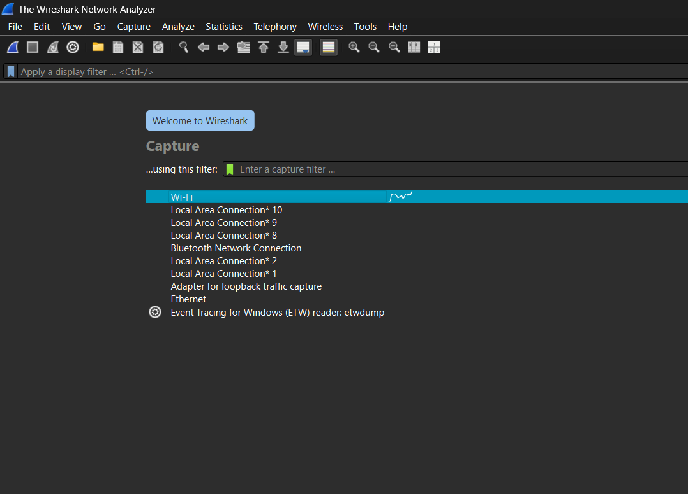

---

## 2. Analisis HTTP GET / Response (Basic)
Langkah selanjutnya adalah melakukan penangkapan paket saat mengakses URL spesifik: `http://gaia.cs.umass.edu/wireshark-labs/HTTP-wireshark-file1.html`.

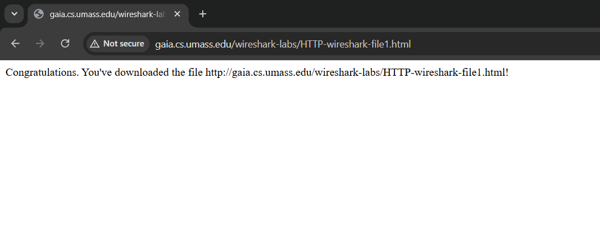

* **Tampilan Browser:** Halaman menampilkan pesan konfirmasi pengunduhan file.
* **Filter Wireshark:** Menggunakan filter `http` pada kolom filter untuk menyaring lalu lintas agar hanya menampilkan protokol yang relevan.

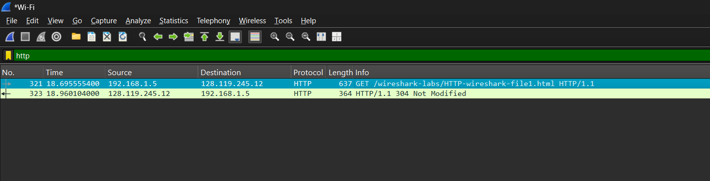

### Hasil Pengamatan:
Ditemukan paket **HTTP GET** dari IP sumber `192.168.1.5` menuju server `128.119.245.12`.
* **Packet No. 378:** Request GET untuk file pertama.
* **Packet No. 394:** Respon dari server berupa `304 Not Modified`, yang mengindikasikan bahwa browser menggunakan file dari cache karena tidak ada perubahan pada server.

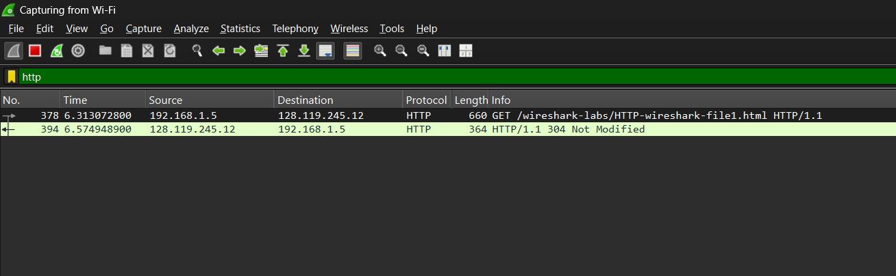

---

## 3. Analisis HTTP Conditional GET
Pada pengujian berikutnya, kita melihat bagaimana mekanisme `If-Modified-Since` bekerja untuk optimasi jaringan.

* **Header Detail:** Dalam HTTP Request, terdapat baris `If-Modified-Since`. Ini adalah instruksi kepada server untuk hanya mengirimkan file jika kontennya telah berubah sejak waktu yang ditentukan.
* **Status Code:** Jika file belum berubah, server akan mengirimkan kode **304 Not Modified**, yang menghemat bandwidth karena isi file tidak perlu dikirim ulang secara keseluruhan.

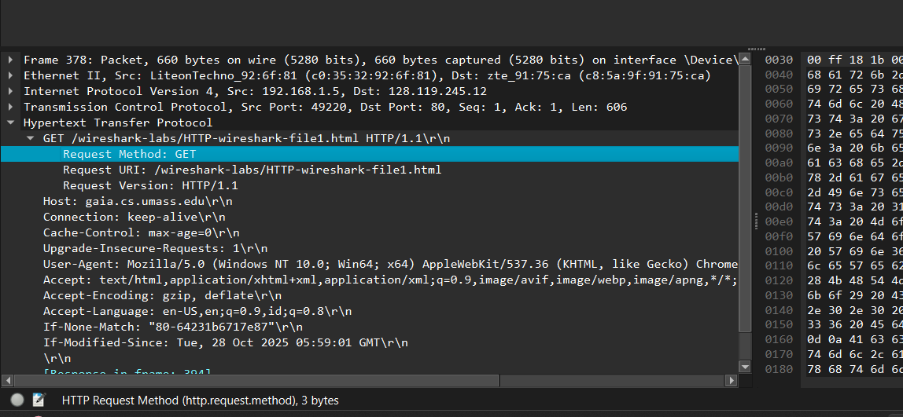

---

## 4. Pengambilan File Berukuran Besar (HTTP GET Lanjutan)
Ketika mengakses file yang lebih kompleks seperti `HTTP-wireshark-file3.html` (berisi teks panjang seperti Bill of Rights), Wireshark menangkap request yang serupa namun dengan payload response yang lebih besar.

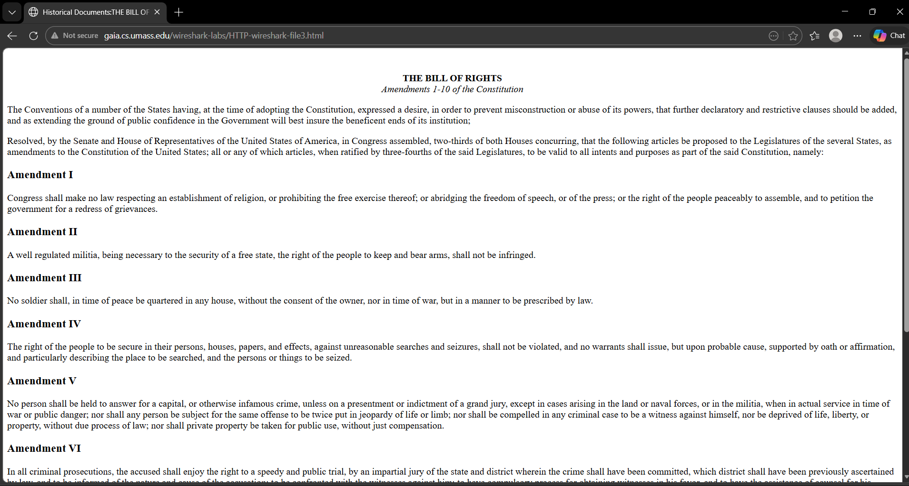

* **Request URI:** `/wireshark-labs/HTTP-wireshark-file3.html`
* **Response:** Server memberikan status `200 OK` (seperti pada gambar paket 12743) yang berarti data dikirim secara penuh karena data tersebut mungkin belum ada di cache atau dipaksa untuk di-refresh.

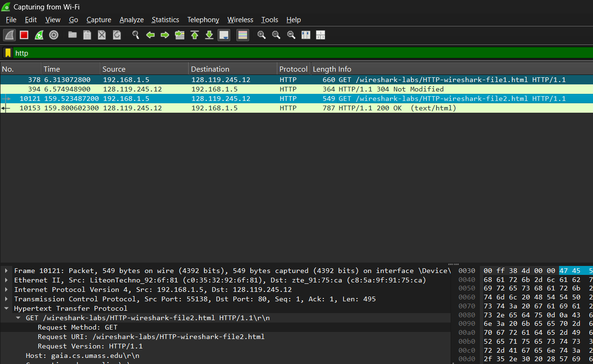

---

## 5. Analisis Dokumen dengan Embedded Objects
Pada percobaan menggunakan file `HTTP-wireshark-file4.html`, halaman tersebut mengandung objek tambahan berupa gambar (logo Pearson dan sampul buku).

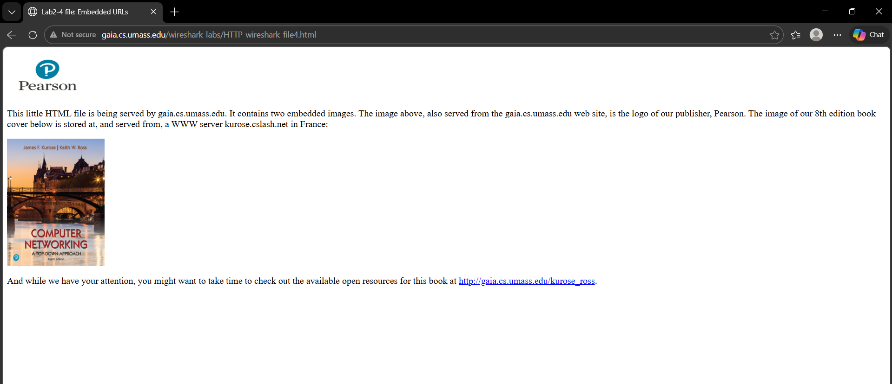

### Temuan pada Wireshark:
1.  **Request Pertama:** Browser mengambil file HTML utama terlebih dahulu.
2.  **Request Lanjutan:** Setelah mengurai (parsing) kode HTML, browser secara otomatis melakukan request tambahan untuk mengambil file gambar seperti `pearson.png` dan `8E_cover_small.jpg`.
3.  **IP Destination Berbeda:** Terlihat adanya komunikasi ke beberapa IP berbeda (seperti `2.56.99.24`) karena objek gambar tersebut disimpan di server atau CDN yang berbeda dari host utamanya.

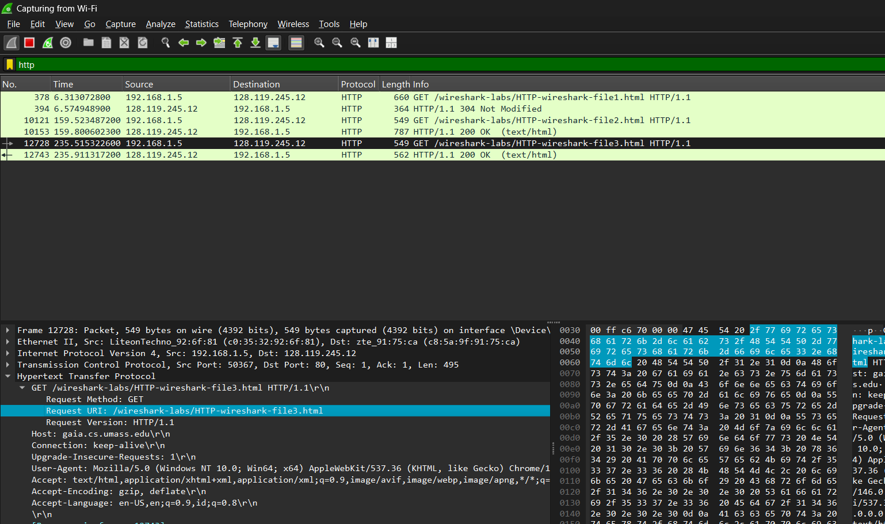

---

## 6. HTTP Password Authentication
Pada tahap ini, dilakukan pengujian terhadap situs yang dilindungi oleh mekanisme autentikasi kata sandi. Akses dilakukan ke URL yang memerlukan kredensial khusus,
http://gaia.cs.umass.edu/wireshark-labs/protected_pages/HTTP-wireshark-file5.html.

**Input Kredensial:** Ketika muncul jendela pop-up, masukkan:
   - **Username:** `wireshark-students`
   - **Password:** `network`

### Analisis Mekanisme:
* **401 Unauthorized:** Saat akses pertama kali tanpa kredensial, server merespons dengan kode **401**. Server juga menyertakan header `WWW-Authenticate` untuk memberi tahu browser bahwa diperlukan login (Basic Auth).
* **Authorization Header:** Setelah pengguna memasukkan username dan password, browser mengirimkan request kembali dengan header `Authorization`. Header ini berisi string terenkripsi (Base64) yang berisi informasi login pengguna.

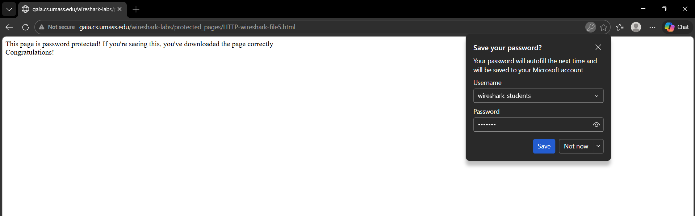

* **Akses Diterima:** Jika kredensial valid, server akan membalas dengan status **200 OK** dan menampilkan konten yang dilindungi.

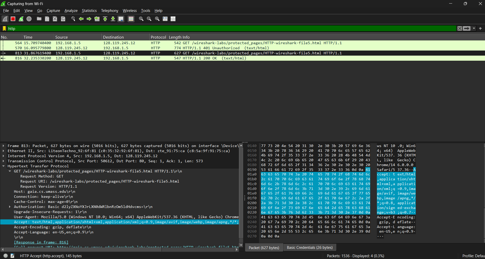

---

## Kesimpulan
Berdasarkan praktikum ini, dapat disimpulkan bahwa:
1.  Protokol HTTP bekerja dengan model **Request-Response** yang sangat terstruktur.
2.  Header `If-Modified-Since` sangat krusial untuk efisiensi caching (Conditional GET) guna meminimalkan penggunaan data yang tidak perlu.
3.  Satu halaman web modern biasanya memicu banyak koneksi HTTP sekaligus (paralel) untuk mengambil objek-objek pendukung seperti gambar dan script.
4.  Keamanan pada HTTP dasar (Basic Authentication) mengirimkan kredensial dalam bentuk yang mudah didekode, sehingga memerlukan lapisan keamanan tambahan seperti HTTPS untuk penggunaan di dunia nyata.